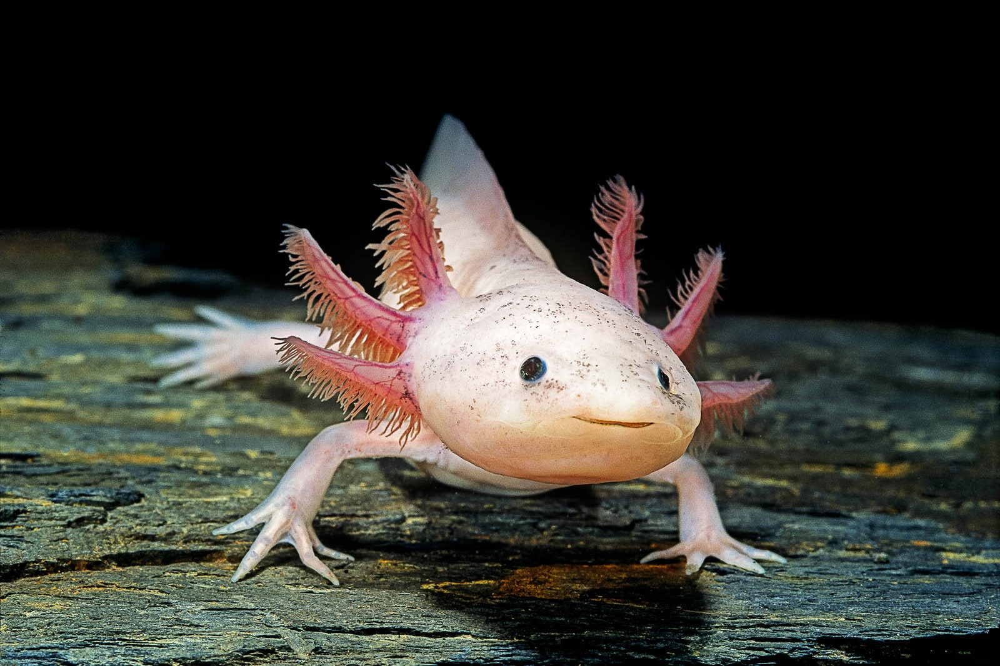

# Página Web de Ajolotes



Esta es mi primera página web, el inicio de una carrera intensa por convertirme en desarrollador de páginas. Hoy, 8 de abril de 2022, si en algún momento regreso a esta página con desmotivación, quiero recordar la sensación que experimenté 
al crear este sitio y las ganas que tengo de convertirme en un profesional. Estoy emocionado por el camino que tengo por delante y por todas las habilidades y conocimientos que adquiriré en el proceso.
Esta es una página web sobre ajolotes, esas increíbles criaturas acuáticas también conocidas como "monstruo del agua" o "bichos de agua". En esta página, encontrarás información interesante y divertida sobre estos fascinantes animales.

## Tecnologías Utilizadas

- HTML
- CSS

## Características

- Página principal con información general sobre los ajolotes.
- Sección de curiosidades sobre los ajolotes.
- Galería de imágenes de ajolotes.
- Contacto para consultas y preguntas relacionadas con los ajolotes.

## Vista Previa

Aquí tienes una vista previa de la página:


https://alexisvennegas.github.io/Ajolotes


## Instalación y Uso

1. Clona este repositorio:

   ```bash
   git clone https://github.com/tu-usuario/pagina-ajolotes.git
